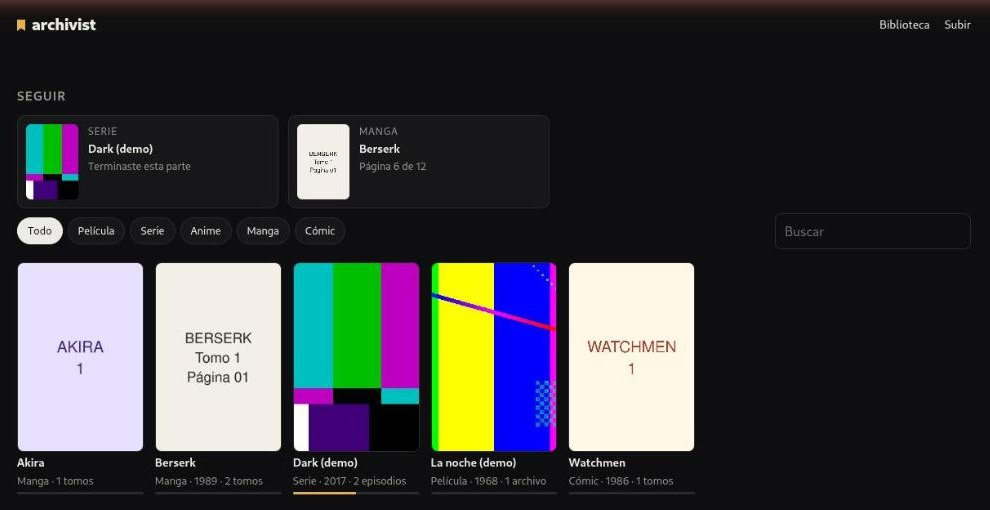
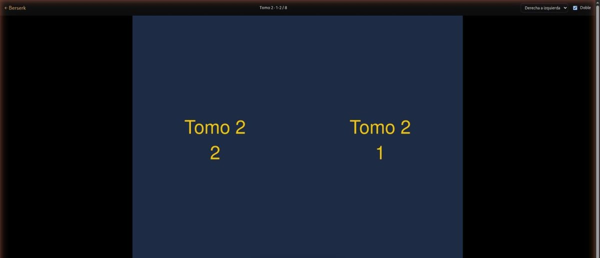

<div align="center">

# archivist

**Everything you own to read or watch, in one place — and it never forgets where you stopped.**
Manga, comics, films, series and anime, served from your own disk, with one
"continue" shelf for all of them and an API for your tools.

[Plan](docs/plan.md) ·
[Security](SECURITY.md) ·
[En castellano](LEEME.md) ·
MIT

<sub>An instrument by</sub><br>
<a href="https://github.com/legiosai"><picture>
  <source media="(prefers-color-scheme: dark)" srcset="docs/legios.svg">
  <source media="(prefers-color-scheme: light)" srcset="docs/legios-claro.svg">
  
</picture></a>



</div>

> **Status: 0.1.** It reads, plays, remembers and takes uploads. Single owner, Spanish UI first.
> What comes next is in [the plan](docs/plan.md).

## What it is

A self-hosted library for what you already have on disk:

- **A reader** for manga and comics (CBZ, ZIP, PDF, folders of images):
  right-to-left, left-to-right, vertical and double-page. It remembers the
  volume, the chapter and the page.
- **A player** for films, series and anime: what the browser plays directly,
  the rest remuxed on the fly with ffmpeg, subtitles included. It remembers the
  episode and the second.
- **One library**: the same story as a manga and as an anime is one work, with
  one place to continue.
- **An API** with a token, so a tool can list works, ask for a page or a frame,
  and read where you are.



## What it is not

It never fetches works: no downloader, no scraper, no source list. It reads the
files you put in its folders. See [SOUL.md](SOUL.md) for the rules it keeps.

## The library on disk

```
library/
  video/<work>.mp4 + <work>.yaml          a film
  video/<work>/S01E01.mkv … + work.yaml    a series or an anime
  pages/<work>/vol-01.cbz … + work.yaml    a manga or a comic
```

The folders are the truth: copy them with rsync, back them up without archivist
running. The database only holds what a disk cannot — where you are.

## Install

**Docker**

```sh
docker build -t archivist https://github.com/legiosai/archivist.git
docker run -d --name archivist -p 8780:8780 \
  -v /path/to/library:/library -v archivist-data:/data \
  -e ARCHIVIST_TOKEN="$(openssl rand -hex 24)" archivist
```

**From source** (Node 22 or newer, plus `ffmpeg` and `poppler-utils`)

```sh
git clone https://github.com/legiosai/archivist && cd archivist
npm ci && npm run build
ARCHIVIST_LIBRARY=/path/to/library ARCHIVIST_TOKEN=… npm start
```

A systemd user unit and an example environment file are in [`deploy/`](deploy/).

| Variable | Default | |
|---|---|---|
| `ARCHIVIST_LIBRARY` | — | The folder with `video/`, `pages/` and `stills/`. |
| `ARCHIVIST_DATA` | `./data` | The database (progress) and the caches. |
| `ARCHIVIST_HOST` | `127.0.0.1` | Any other address requires a token. |
| `ARCHIVIST_PORT` | `8780` | |
| `ARCHIVIST_TOKEN` | — | For the API (`Authorization: Bearer`) and the browser login. |
| `ARCHIVIST_BACKUP_DIR` | — | A daily copy of the database (progress), the newest 14 kept. |
| `ARCHIVIST_TRUSTED` | — | Networks that need no token: `loopback`, `tailscale`, `lan`, or CIDRs (`192.168.1.0/24`). Judged by the connection's address, never by headers. |

## API

Everything the UI does goes through [the API](docs/api.md): works, units, pages, single frames,
progress, events and resumable uploads. Tools get pages and frames, never clips.

## Develop

```sh
npm install
npm test
npm run typecheck
npm run dev            # the UI with hot reload, against a server on :8780
```
